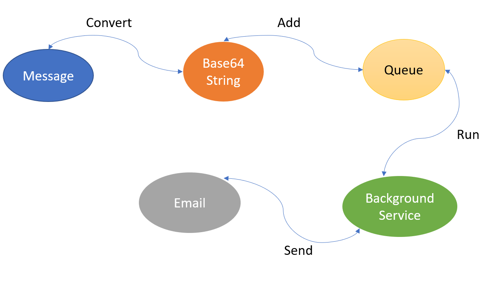
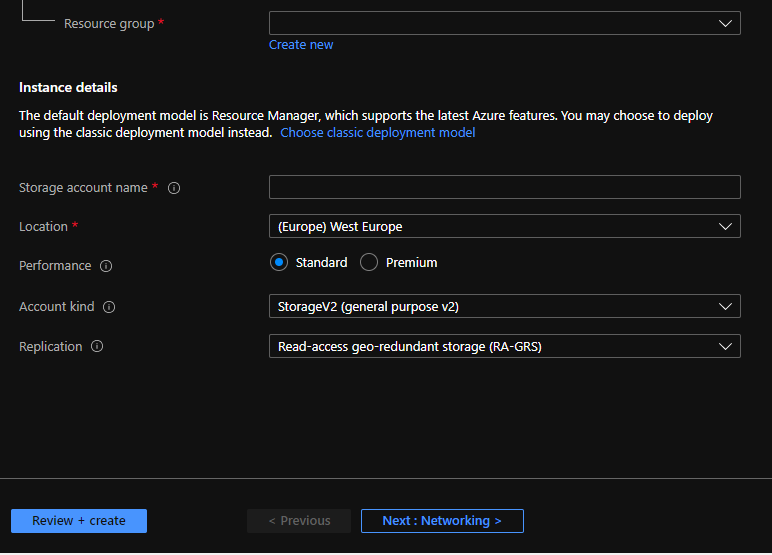
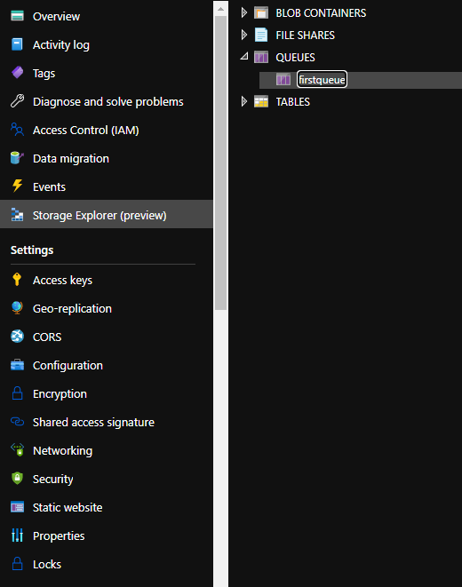
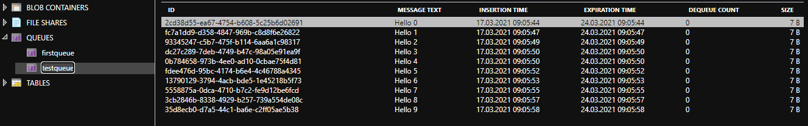
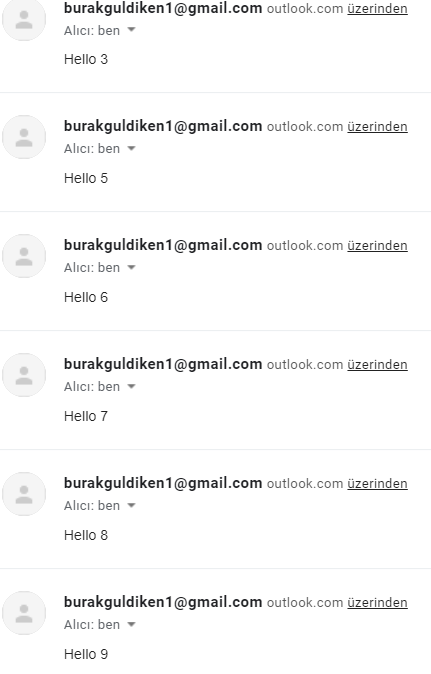
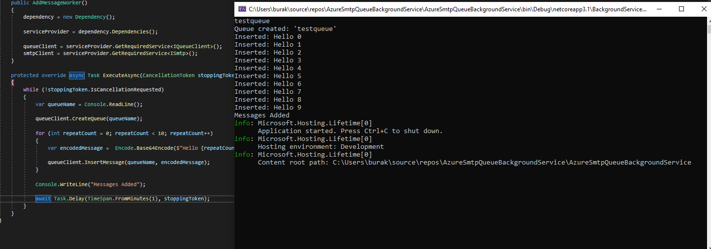

## Azure Storage Account Queue Operation

Azure Queue storage is a service for storing large numbers of messages accessible from anywhere in the world through authenticated calls using HTTP or HTTPS. A single queue message can be up to 64 KB in size, and a queue can have millions of messages up to the total capacity limit of the storage account. Queue storage is often used to create a backlog of jobs to be processed asynchronously.

<br><br>

## What's In The Content ?

Adding data to the queue, deleting data, updating data, creating a queue, deleting the queue are included in the project. At the same time, receiving data from the queue with smtp and sending it as e-mail and the use of background services are included in the project.

<br><br>

## Background Service

```c#
public static IHostBuilder CreateHostBuilder(string[] args) =>
            Host.CreateDefaultBuilder(args)
                .ConfigureServices((hostContext, services) =>
                {
                    args = new string[2];

                    args[0] = "2";

                    if (Convert.ToInt32(args[0]) == (int)EnumWorker.AddMessageWorker)
                    {
                        services.AddHostedService<AddMessageWorker>();
                    }
                    else if(Convert.ToInt32(args[0]) == (int)EnumWorker.SendSmsWorker)
                    {
                        services.AddHostedService<SendSmsWorker>();
                    }
                });
```

If arg = 1 is given, it creates a queue and the worker that will allow you to add data to that queue will run. If arg = 2 is selected, data is received from the queue and sent to the address specified as sms, and if there are no elements left in the queue, the queue is deleted.

<br><br>

## Add Message To Queue

```c#
public void InsertMessage(string queueName, string message)
        {
            QueueClient queueClient = CreateQueueClient(queueName);

            queueClient.CreateIfNotExists();

            if (queueClient.Exists())
            {
                queueClient.SendMessage(message);
            }

            var decodedMessage = Decode.Base64Decode(message);

            Console.WriteLine($"Inserted: {decodedMessage}");
        }
```

<br><br>

## Creating Queues with Storage Account

- Sign in with your azure account
  
- Search for storage account
  
- Create a new storage account
  

 
 


<br><br>

## Results

 
 

